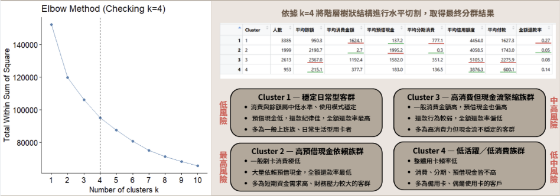

# Credit Card Customer Segmentation & Marketing Strategy
### Data-Driven Market Research Project (Grade: A+)

  

## Executive Summary
This project analyzes the behavior of **9,000+ credit card holders** to formulate precision marketing strategies. By utilizing **Hierarchical Clustering (Ward's Method)** in R, we segmented the customer base into 4 distinct strategic personas. 

The goal is to translate raw transaction data into **actionable business insights**, helping stakeholders identify high-value customers and mitigate credit risks.

**[Click here to view the full Analysis Report (PDF)](./Analysis_Report.pdf)** *(Highly recommended for detailed visualization and strategy breakdown)*

---

## Key Methodologies
* **Data Cleaning:** Handled missing values (NA) using median imputation and performed log-transformation/scaling for normalization.
* **Clustering Algorithm:** Implemented **Hierarchical Clustering** (Ward's Method) to identify natural groupings.
* **Optimization:** Utilized the **Elbow Method** to scientifically determine the optimal number of clusters (k=4).
* **Business Analysis:** Translated statistical clusters into business personas for targeted marketing.

---

## Customer Personas & Strategy
Based on the clustering results, we identified four key customer segments and proposed tailored strategies for each:

| Cluster | Persona Name | Characteristics | Marketing Strategy |
| :--- | :--- | :--- | :--- |
| **1** | **Stable Daily Users** (37%) | Moderate spending, high repayment discipline. | **Retention:** Offer daily cashback rewards to maintain loyalty. |
| **2** | **Cash Advance Risk Group** (22%) | High reliance on cash advances, low purchase frequency. | **Risk Management:** Monitor credit limits strictly and offer installment plans. |
| **3** | **VIP High Spenders** (10%) | High balance, high purchase frequency, high credit limit. | **Premium Service:** Provide exclusive concierge services and luxury rewards. |
| **4** | **Low Activity Users** (31%) | Low frequency and spending across all metrics. | **Activation:** Send reactivation offers or low-barrier coupons to stimulate usage. |

---

## Result Preview
Below is the clustering visualization (projected onto 2D using PCA):

*(Please ensure you upload an image named 'result_preview.png' for this to show)*

---

## Tools Used
* **Language:** R
* **Libraries:** `dplyr` (Data Manipulation), `cluster` (Algorithm), `factoextra` (Visualization), `readr`.

## Contact
* **Author:** 盧宜婷 Yi-Ting Lu
* **Role:** Technical Implementation & Strategy Formulation
* **Email:** luyiting20040930@gmail.com
